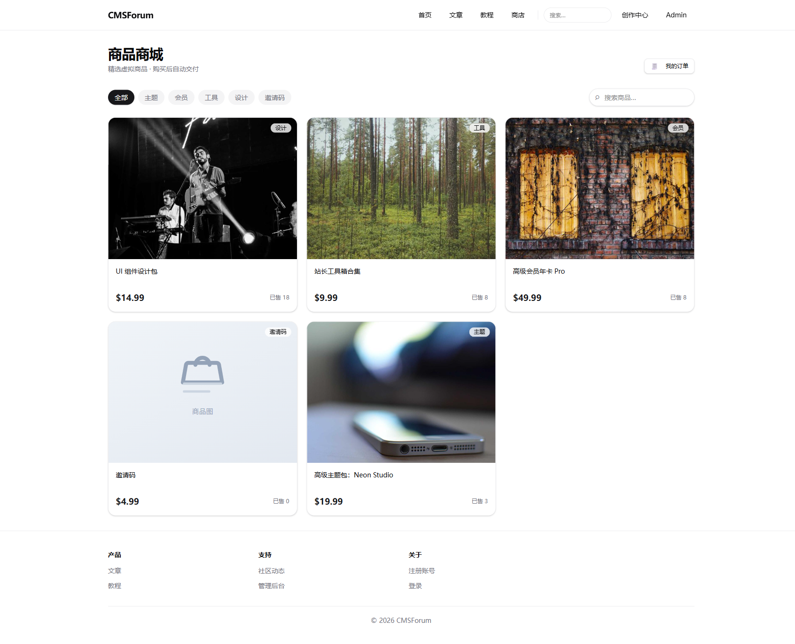
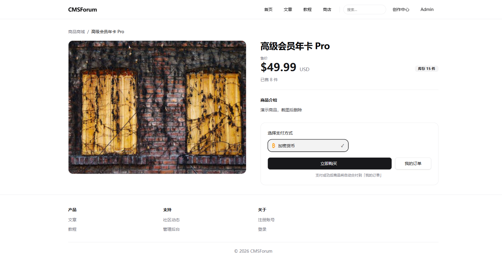
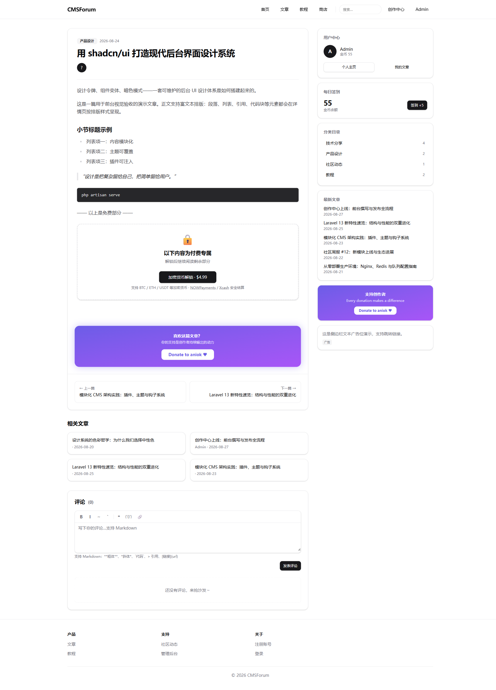
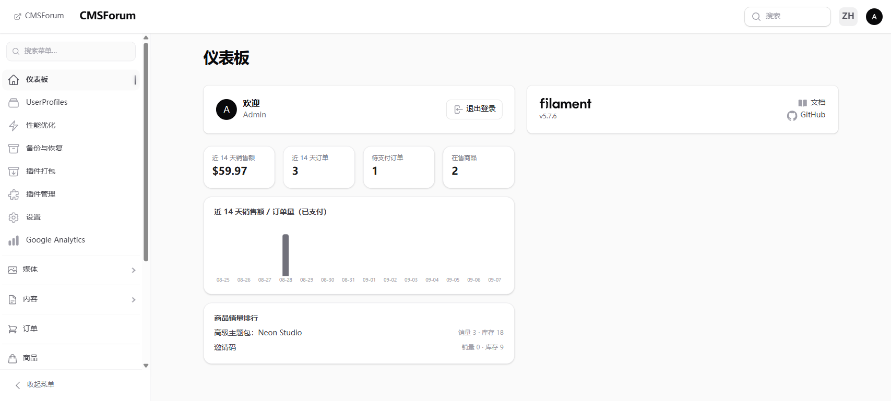
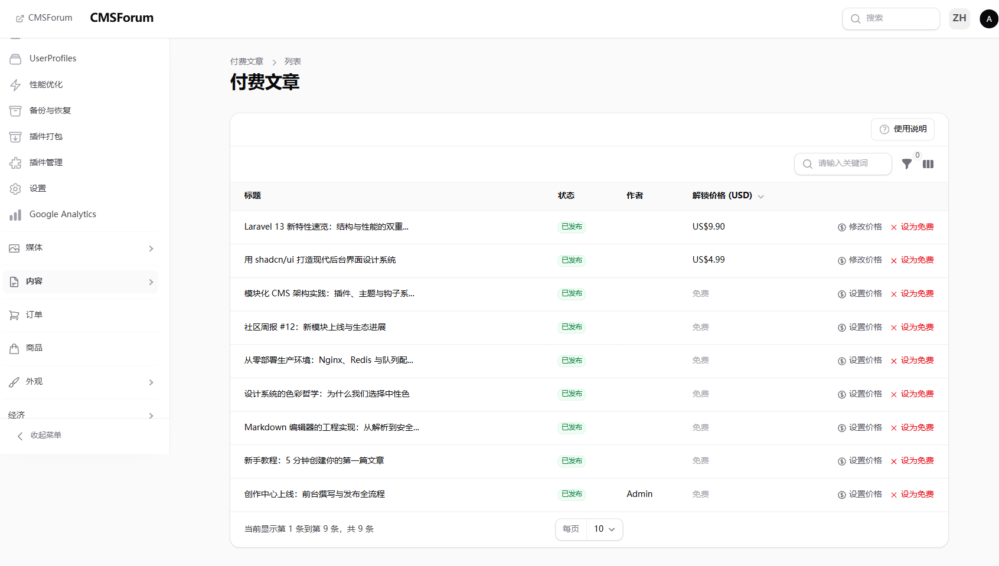
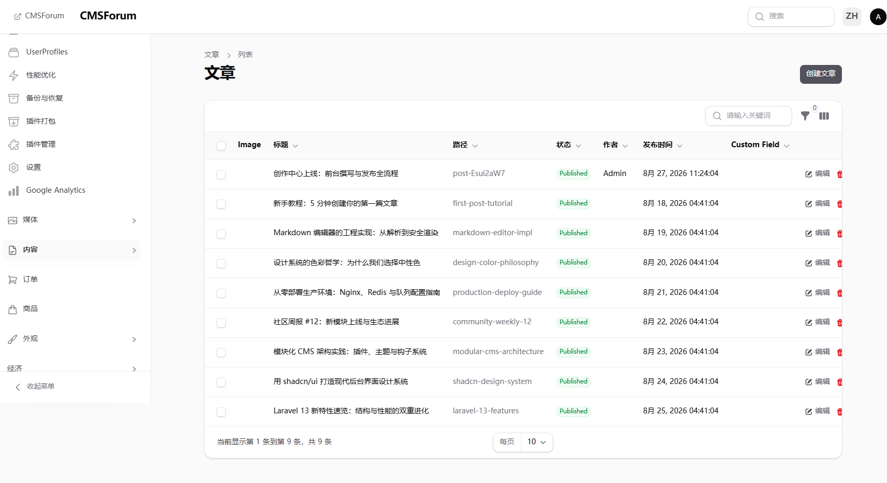
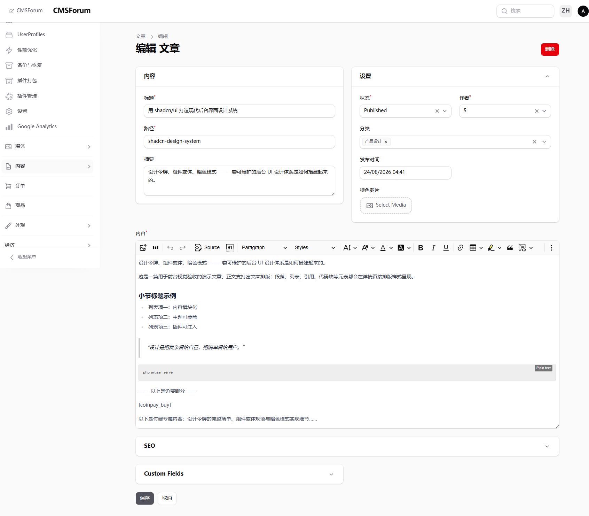

# simpleCMS

> [**中文**](README.md) · **English**

A plugin-based content community platform (CMS + BBS) built with **Laravel 13 + Filament 5 + Inertia/Vue 3**.

The underlying CMS foundation is provided by the [`miran/mksine`](https://github.com/miransalehi/mksine) v1.4.0 core (posts, categories, media library, menus, settings, plugin/theme/hook/shortcode system), with business features layered on top as **pluggable modules**.

> 📦 For production deployment, read the **[Deployment Guide](docs/DEPLOYMENT.en.md)** — or the [Chinese version](docs/DEPLOYMENT.md).
> 📖 Full project documentation: [《项目文档》](docs/项目文档.md) (Chinese).

---

## 📸 Screenshots

| Shop (front-end) | Product Detail |
| --- | --- |
|  |  |

| Paid Reading (front-end) | Admin Dashboard |
| --- | --- |
|  |  |

| Paid Posts Admin | Post List | Post Editor |
| --- | --- | --- |
|  |  |  |

---

## ✨ Highlights

- **Plugin architecture**: 9 business modules, each independently installable / activatable / deactivatable / uninstallable (`modules/`)
- **Unified payment gateway**: CodePay / XunHuPay / PayPal / Xcash (crypto) / Mock channels coexist; users pick a method at checkout
- **Paid reading**: insert `[coinpay_buy price="4.99"]` in the article body for section-based paywall; admins set default prices under "Content → Paid Posts"
- **Content community**: posts / categories / comments / single pages / banners / search / RSS / Sitemap / scheduled publishing
- **Author studio**: front-end writing, rich-text editor, personal & security settings, author center
- **Economy system**: multi-currency wallet, check-in / publishing rewards, invite codes (gold / crypto purchase / registration redemption)
- **Shop**: products / stock (reserved at checkout to prevent overselling) / orders / multi-type delivery (download / content / invite code)
- **i18n**: system and modules ship with `en` and `zh_CN` language packs, switchable in the admin panel
- **Performance**: full-page caching (WP Super Cache style), optional Redis / OPcache / Octane / Horizon
- **Security**: email domain whitelist, optional mandatory invite registration, Turnstile / math CAPTCHA, rate limits on login / register / comment / check-in, whitelist-based rich-text sanitization, idempotent payment callbacks

## 🧰 Tech Stack

| Layer | Components |
| --- | --- |
| Backend | PHP ^8.3 · Laravel 13.27 · Filament 5.7 · Livewire 4.4 · miran/mksine 1.4 · Filament Shield 4.3 · spatie/laravel-permission 8.3 |
| Frontend | Vue 3.5 · Inertia 3.7 · Vite 8 · Tailwind CSS 4 · TypeScript |
| Infrastructure | Horizon 5.48 · Octane 2.19 · Redis (optional) · CoinPayments SDK |

> 🚀 **Powered by Vast.ai** (unofficial support — the author's personal setup): this project is developed, built and demo-hosted on [Vast.ai](https://cloud.vast.ai/?ref_id=91181) GPU cloud servers. Vast.ai is the world's largest decentralized GPU marketplace — rent RTX 4090 / A100 instances by the hour for model inference, CI builds, cloud hosting and more. If you need elastic compute, sign up via [this referral link](https://cloud.vast.ai/?ref_id=91181).

## 🌱 Prerequisites

| Component | Version | Purpose |
| --- | --- | --- |
| PHP | ^8.3 (8.5 recommended) | Runtime; needs pdo_mysql / mbstring / curl / openssl / intl extensions |
| MySQL | 8.0+ | Primary database (utf8mb4) |
| Redis | 6.0+ (optional) | Cache / queue / sessions; falls back to the database driver |
| Composer | 2.x | Dependency management |
| Node.js | 20+ | Frontend build |

> On Windows, [Laragon](https://laragon.org) is the recommended local environment (bundles PHP + MySQL, one-click startup).

## 🚀 Quick Start (development)

```bash
composer install
cp .env.example .env
php artisan key:generate
php artisan migrate --force
npm install --ignore-scripts && npm run build

# Create the admin account (credentials come from .env)
php artisan db:seed --class=AdminAccountSeeder
```

`.env` configuration:

```dotenv
ADMIN_DEFAULT_EMAIL=admin@cmsforum.test
ADMIN_DEFAULT_PASSWORD=<your-password>
```

Start the whole dev environment (server + queue + logs + vite) with one command:

```bash
composer dev
```

Admin panel: `/admin`

## 🧩 Modules

All business capabilities live in `modules/` and can be installed / enabled / disabled / uninstalled independently.

| Module | Capabilities | Depends on |
| --- | --- | --- |
| `user` | User profiles, registration flow (email code / domain whitelist / invite registration) | — |
| `cms` | Permalinks, category pages, search, RSS, Sitemap, single pages, banners, comments, author studio | `user` |
| `economy` | Multi-currency wallets (gold/silver/copper), idempotent ledgers | `user` |
| `quest` | Daily check-in, publishing rewards | `user`, `economy` |
| `crypto-pay` | Paid reading + unified payment gateway (CodePay/XunHuPay/PayPal/Xcash/Mock) | — |
| `shop` | Products, stock, orders, multiple delivery types | — |
| `invite` | Invite code generation / gold or crypto purchase / registration redemption | — |
| `ads` | Ad management across 11 placement positions | — |
| `performance` | Full-page cache, hit stats, Redis/OPcache/Octane/Horizon detection | — |

Suggested activation order: `user` → `economy` → `quest` → `cms` → others:

```bash
php artisan mks-plugin:discover
php artisan mks-plugin:install user && php artisan mks-plugin:activate user
php artisan mks-plugin:migrate user
```

## ✅ Testing

```bash
php artisan test
```

The test database is MySQL `cmsforum_test` (see `phpunit.xml`); module tests are based on `Modules\Tests\ModuleTestCase` (SAVEPOINT transaction rollback, no pollution of the dev database).

## 🔧 Common Commands

```bash
php artisan mks-plugin:list --status=active   # plugin status
php artisan mks:discover                      # hook discovery
php artisan schedule:work                     # scheduled publishing (every minute)
php artisan queue:work --tries=3
php artisan test
```

## 📂 Directory Overview

```
app/        Application layer: sidebar engine, site settings, backup/packaging, admin pages, policies
modules/    9 business plugins (plugin.php manifest + migrations/routes/models/admin resources/front-end pages)
config/     mksine.php is the core config (690 lines, annotated)
docs/       project docs, deployment guides, design drafts, payment SDKs, security audit, screenshots
```

## 📚 Documentation

- **[Deployment Guide (English)](docs/DEPLOYMENT.en.md)** — environment requirements, Nginx/HTTPS, queues & scheduler, Redis/Octane, security hardening, upgrades & backups, troubleshooting
- **[《生产部署手册》](docs/DEPLOYMENT.md)** (Chinese)
- **[《项目文档》](docs/项目文档.md)** (Chinese) — architecture, modules, data models, routes, permissions, payments, performance, ops, extension guide
- [Security & Code Audit Report](docs/安全与代码审计报告.md) (Chinese) — white-box audit findings and fix status
- [Xcash API protocol](docs/xcash.md) (Chinese)

## License

Built on Laravel, released under the [MIT license](https://opensource.org/licenses/MIT).
